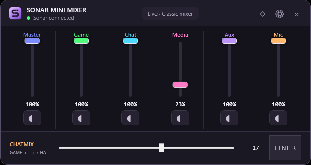

<div align="center">
  
  <h1>Sonar Mini Mixer</h1>
  <p><strong>A compact Windows tray mixer for SteelSeries Sonar.</strong></p>
  <p>Control every Classic mixer channel and ChatMix without keeping the full SteelSeries GG window open.</p>

  [](#requirements)
  [](https://dotnet.microsoft.com/)
  [](https://github.com/msftMyt/SonarMiniMixer/actions/workflows/build.yml)
  [](https://github.com/msftMyt/SonarMiniMixer/releases/latest)
  [](LICENSE)
</div>

<p align="center">
  
</p>

> [!IMPORTANT]
> Sonar Mini Mixer is an independent community project. It is not affiliated with, endorsed by, or supported by SteelSeries. SteelSeries, Sonar, and GG are trademarks of their respective owner.

## Why Sonar Mini Mixer?

SteelSeries Sonar is powerful, but changing one volume level normally means reopening the full GG interface. Sonar Mini Mixer keeps the controls you use most in a small native popup:

- **Six live channels** — Master, Game, Chat, Media, Aux, and Mic
- **Volume and mute** for every channel
- **Game / Chat balance** with one-click centering
- **Tray popup** that disappears when you are done
- **Pinned mode** for a movable, resizable, always-on-top mixer
- **Two-way synchronization** with Sonar and the GG mixer UI
- **Automatic reconnection** after GG or Sonar restarts
- **Optional Windows startup** with no administrator privileges
- **No drivers, telemetry, accounts, ads, or cloud service**

## Requirements

| Requirement | Details |
|---|---|
| Operating system | Windows 10 or Windows 11, x64 |
| SteelSeries software | SteelSeries GG with Sonar installed and enabled |
| Mixer mode | **Classic** mode for write controls |
| .NET runtime | Not required for the self-contained release |

## Install

### Download a release

1. Open the [latest release](https://github.com/msftMyt/SonarMiniMixer/releases/latest).
2. Download `SonarMiniMixer-win-x64.zip` and its `.sha256` file.
3. Verify the checksum if desired:

   ```powershell
   Get-FileHash .\SonarMiniMixer-win-x64.zip -Algorithm SHA256
   ```

4. Extract the ZIP to a permanent folder such as `%LOCALAPPDATA%\Programs\SonarMiniMixer`.
5. Run `SonarMiniMixer.exe`.

Windows may show SmartScreen because community builds are not code-signed. Review the source and checksum before selecting **Run anyway**.

### Build from source

Install the current [.NET SDK](https://dotnet.microsoft.com/download), clone the repository, then run:

```powershell
dotnet build .\SonarMiniMixer.slnx -c Release
.\tools\Build-Release.ps1
.\tools\Install.ps1
```

`Install.ps1` copies the app and diagnostics CLI to `%LOCALAPPDATA%\Programs\SonarMiniMixer` and creates a Start Menu shortcut. It does not require administrator rights.

## Use

1. Start SteelSeries GG and confirm Sonar is enabled.
2. Launch **Sonar Mini Mixer**.
3. Click its purple icon in the Windows notification area.
4. Drag a fader, scroll over it, or use the arrow keys while it is focused.
5. Click the button below a channel to mute or unmute it.
6. Use **ChatMix** to favor Game or Chat; click **Center** or press `Ctrl+0` to reset it.

### Window and tray controls

| Control | Action |
|---|---|
| Hollow diamond | Pin the mixer; it stays open, appears in the taskbar, and can be moved or resized |
| Filled diamond | Return to auto-hiding popup behavior |
| Gear | Open settings |
| X | Hide the mixer without exiting |
| `Esc` | Hide an unpinned mixer |
| Left-click tray icon | Show or hide the unpinned mixer |
| Right-click tray icon | Open the mixer, open Settings, or exit |

### Start with Windows

Open **Settings**, enable **Start Sonar Mini Mixer when I sign in**, and select **Save**. This creates one per-user entry under:

```text
HKCU\Software\Microsoft\Windows\CurrentVersion\Run
```

Turning the option off removes that entry.

## How synchronization works

Sonar Mini Mixer is a remote-control surface, not an audio engine. It does not process audio, install devices, or reroute applications.

```text
Sonar Mini Mixer
├─ reads channel state and ChatMix from Sonar's loopback service
├─ writes channel volume/mute through matching Windows Core Audio endpoints
└─ writes ChatMix through Sonar's local control and GG notification paths
```

This hybrid local integration allows both the audio state and SteelSeries GG's visible mixer controls to remain synchronized. Sonar's service port is rediscovered dynamically whenever GG restarts.

## Connection states

| Status | Meaning |
|---|---|
| **Sonar connected** | Controls are live and synchronized |
| **Sonar unavailable** | GG or Sonar is not running; the mixer retries automatically |
| **Unsupported mode** | State remains visible, but writes are disabled to fail safely |
| **ChatMix unavailable** | The current Sonar device configuration does not expose ChatMix |

## Privacy and security

- Communicates only with validated loopback services on this PC
- Reads GG's local `coreProps.json` only to discover current local endpoints
- Uses Core Audio only for friendly names matching Sonar's six virtual channels
- Rejects non-loopback service addresses
- Accepts GG's self-signed certificate only after validating a loopback address
- Restricts named-pipe commands to the current Windows user
- Stores only window size, pin state, and location in `%LOCALAPPDATA%\SonarMiniMixer\settings.json`
- Does not store credentials, audio, SteelSeries configuration, or mixer history
- Contains no analytics, telemetry, advertisements, or cloud integrations

See [SECURITY.md](SECURITY.md) for vulnerability reporting and the security model.

## Diagnostics

The release includes `SonarMiniMixer.Cli.exe` for read-only diagnostics and local app control:

```powershell
# Print current Sonar state as JSON
.\SonarMiniMixer.Cli.exe status

# Run read-only endpoint discovery and an API smoke test
.\SonarMiniMixer.Cli.exe selftest

# Show the tray mixer if it is running
.\SonarMiniMixer.Cli.exe show

# Exit the tray app
.\SonarMiniMixer.Cli.exe exit
```

`status` and `selftest` do not change mixer settings.

## Troubleshooting

<details>
<summary><strong>The tray icon is hidden</strong></summary>

Open the notification-area overflow menu and drag **Sonar Mini Mixer** onto the taskbar, or enable it under **Taskbar settings → Other system tray icons**.
</details>

<details>
<summary><strong>The app says Sonar is unavailable</strong></summary>

1. Confirm SteelSeries GG is running.
2. Open GG and confirm Sonar is enabled.
3. Run `SonarMiniMixer.Cli.exe selftest` in PowerShell.
4. Restart GG if its local service is stale.
</details>

<details>
<summary><strong>The controls are disabled</strong></summary>

Switch Sonar to **Classic** mixer mode. The app deliberately refuses writes in unsupported modes.
</details>

<details>
<summary><strong>A SteelSeries GG update broke control</strong></summary>

Sonar's local API is not publicly documented and may change. Open an issue containing:

- Your SteelSeries GG and Sonar versions
- The exact status message shown by the app
- Output from `SonarMiniMixer.Cli.exe selftest`

Do **not** attach `coreProps.json`; it contains local service connection data.
</details>

## Build and test

```powershell
# Build all projects
dotnet build .\SonarMiniMixer.slnx -c Release

# Run the test suite
dotnet run --project .\SonarMiniMixer.Tests\SonarMiniMixer.Tests.csproj -c Release

# Create self-contained Windows executables
.\tools\Build-Release.ps1

# Install and run native UI/process QA
.\tools\Install.ps1
.\tools\QA.ps1

# Regenerate the privacy-safe README screenshot
.\tools\Capture-Screenshot.ps1
```

### Project layout

| Project | Purpose |
|---|---|
| `SonarMiniMixer.App` | Native WPF tray app and mixer UI |
| `SonarMiniMixer.Core` | Sonar discovery, parsing, synchronization, settings, and Core Audio integration |
| `SonarMiniMixer.Cli` | Read-only diagnostics and local app commands |
| `SonarMiniMixer.Tests` | Dependency-free executable test suite |
| `tools` | Build, install, screenshot, icon, and QA automation |

The app uses WPF, the Windows Forms `NotifyIcon`, and [NAudio](https://github.com/naudio/NAudio) for Windows Core Audio endpoint control.

## Uninstall

1. Right-click the tray icon and select **Exit**.
2. Disable **Start with Windows**, or delete the `SonarMiniMixer` value under `HKCU\Software\Microsoft\Windows\CurrentVersion\Run`.
3. Delete `%LOCALAPPDATA%\Programs\SonarMiniMixer`.
4. Optionally delete `%LOCALAPPDATA%\SonarMiniMixer` to remove saved window settings and diagnostics.
5. Delete the **Sonar Mini Mixer** Start Menu shortcut if you used `Install.ps1`.

## Known limitation

SteelSeries does not document Sonar's local API. The app dynamically discovers changing ports and fails closed on unknown modes or channels, but a future GG update may require a compatibility update.

## Contributing

Bug reports and focused pull requests are welcome. Before submitting anything, remove personal paths, `coreProps.json`, settings files, logs, local service addresses, and machine-specific identifiers.

## License

Sonar Mini Mixer is available under the [MIT License](LICENSE).
